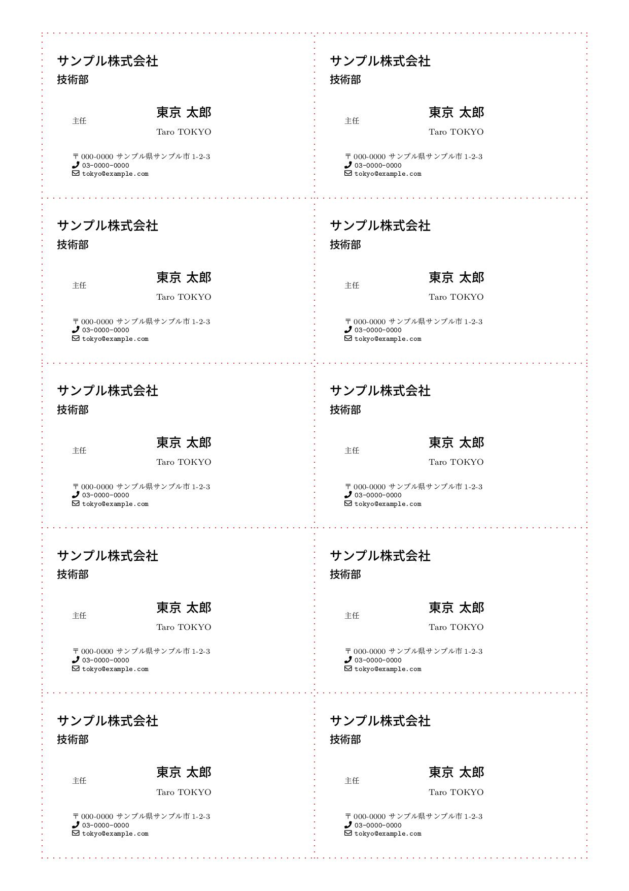
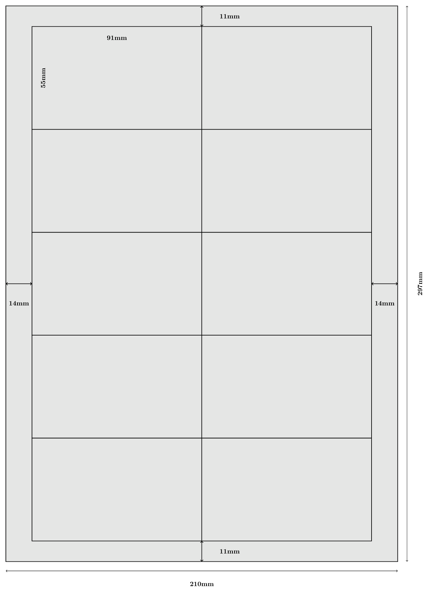

# namecard.sty

LaTeX用の名刺スタイルファイルです。A4用紙に2列×5行の名刺（91mm×55mm）を配置します。

## 特徴

- A4用紙に10枚の名刺を配置（2列×5行）
- 日本語名と英語名の併記に対応
- 肩書き、会社名、部署名、住所、電話番号、メールアドレスを設定可能
- レイアウトの微調整が可能
- **LuaLaTeX、upLaTeX に対応**
- **印刷されない境界線表示**（PDFレイヤー機能）

## 必要環境

- TeX Live 2020以降（推奨）
- 対応エンジン:
  - **LuaLaTeX**（推奨）
  - **upLaTeX** + dvipdfmx
- ドキュメントクラス: **jlreq**

## インストール

### 方法1: プロジェクトに直接配置

`namecard.sty` をTeXファイルと同じディレクトリに配置してください。

### 方法2: TeXMFツリーに配置

```bash
# ローカルのtexmfディレクトリに配置
mkdir -p ~/texmf/tex/latex/namecard
cp namecard.sty ~/texmf/tex/latex/namecard/

# TeX Live のデータベースを更新
mktexlsr ~/texmf
```

## 使い方

### 基本的な使用例

```latex
\documentclass[a4paper]{jlreq}
\usepackage{namecard}

% 名刺の内容を設定
\setCompany{株式会社サンプル}
\setDepartment{開発部}
\setName{山田 太郎}
\setNameEnglish{Taro YAMADA}
\setAddress{〒000-0000 サンプル県サンプル市1-2-3}
\setPhone{TEL: 03-xxxx-xxxx}
\setEmail{Email: taro@example.com}
\setKatagaki{主任}

% レイアウトの調整（必須）
\SetLeftMarginOfNameCard{5}    % 左余白（mm）
\SetIndentOfNameCard{10}       % コンテンツのインデント（mm）
\setlength{\unitlength}{1truemm}

\begin{document}
\makeNameCard  % 1ページ分（10枚）の名刺を出力
\end{document}
```

### 境界線表示（印刷されない）

`frame`オプションを使用すると、名刺の境界線が**赤い点線**で表示されます。
この境界線は**画面上では見えますが、印刷時には出力されません**（PDFレイヤー機能）。

```latex
\usepackage[icons,frame]{namecard}
```

### 設定コマンド

| コマンド | 説明 |
|----------|------|
| `\setCompany{...}` | 会社名 |
| `\setDepartment{...}` | 部署名 |
| `\setName{...}` | 氏名（日本語） |
| `\setNameEnglish{...}` | 氏名（英語） |
| `\setAddress{...}` | 住所 |
| `\setPhone{...}` | 電話番号 |
| `\setEmail{...}` | メールアドレス |
| `\setKatagaki{...}` | 肩書き |

### レイアウト調整コマンド

| コマンド | 説明 |
|----------|------|
| `\SetLeftMarginOfNameCard{...}` | 名刺内の左余白（mm） |
| `\SetIndentOfNameCard{...}` | コンテンツのインデント（mm） |

### パッケージオプション

| オプション | 説明 | 対応エンジン |
|------------|------|--------------|
| `frame` | 印刷されない境界線を表示 | すべて |

## ビルド方法

### Makefileを使用（推奨）

```bash
make              # LuaLaTeXでビルド（デフォルト）
make lualatex     # LuaLaTeXでビルド
make uplatex      # upLaTeXでビルド
make all          # すべてのバリエーションをビルド
make clean        # 中間ファイルを削除
make distclean    # PDFを含むすべての生成ファイルを削除
```

### Latexmkを使用

```bash
# LuaLaTeX（デフォルト・推奨）
latexmk sample.tex

# upLaTeX
latexmk -pdfdvi -latex='uplatex' sample.tex
```

### 手動でビルド

```bash
# LuaLaTeX
lualatex sample.tex

# upLaTeX
uplatex sample.tex && dvipdfmx sample.dvi
```

## サンプル出力



## 名刺サイズについて

日本の標準的な名刺サイズ（91mm×55mm）に対応しています。
A4用紙（210mm×297mm）に2列×5行で配置されます。



| 項目 | サイズ |
|------|--------|
| 用紙 | A4 (210mm × 297mm) |
| 名刺 | 91mm × 55mm |
| 左右余白 | 各14mm |
| 上下余白 | 各11mm |
| 配置 | 2列 × 5行 = 10枚/ページ |

## カスタマイズ

### 複数ページの名刺を出力

`\makeNameCard` を複数回呼び出すことで、複数ページ分の名刺を出力できます。

```latex
\begin{document}
\makeNameCard  % 1ページ目
\makeNameCard  % 2ページ目
\end{document}
```

### 肩書きを複数行にする

```latex
\setKatagaki{%
  係長 \\
  博士（情報工学）
}
```

## ライセンス

MIT License - 詳細は [LICENSE](LICENSE) を参照してください。

## 参考

- 参考サイト: http://www.w3-4f5f.ee.uec.ac.jp/nameCard/ （現在リンク切れ）
